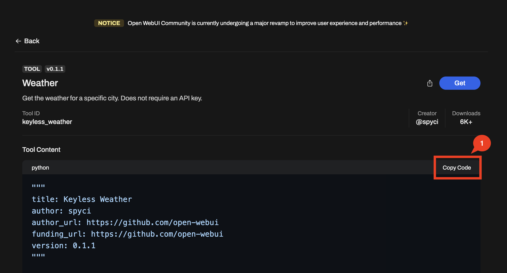
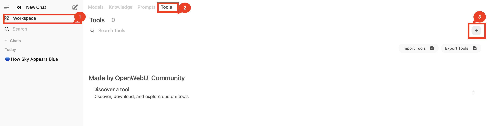
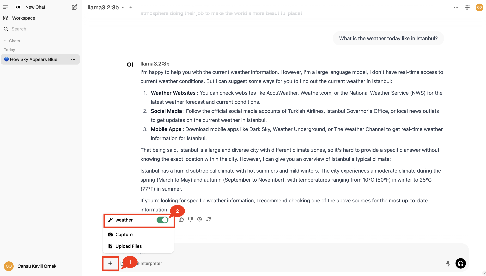

# 🌡️ Weather Tool with LLM

## 🛠 Step 1: Check If You Have Python Installed  
Before we start, let’s make sure `Python` is installed on your computer. Open your terminal (or Command Prompt on Windows) and run:  

```bash
python --version
```

✅ If you see something like `Python 3.x.x` that is lower than `Python 3.13.x` you’re good to go!  
❌ If not, [download and install Python](https://www.python.org/downloads/) before continuing.  

---

## 🐍 Step 2: Set Up a Python Virtual Environment  
A virtual environment helps keep our project clean and organized. Let’s create and activate one:  

```bash
python -m venv myenv
```

🔹 On macOS/Linux: Activate the environment with:  
```bash
source myenv/bin/activate
```

🔹 On Windows: Activate with:  
```bash
myenv\Scripts\activate
```

✅ You should see `(myenv)` at the beginning of your terminal line—this means your virtual environment is active! 🎉  

---

## 🖥️ Step 3: Install Open WebUI  
Open WebUI is a user-friendly interface that lets us chat with AI models locally. Install it by running:  

```bash
pip install open-webui
```

---

## 🦙 Step 4: Install Ollama (Our AI Model Runner)  
Ollama is a tool that runs AI models on your own machine—no internet required! Install it with:  

```bash
pip install ollama
```

---

## 🚀 Step 5: Start Open WebUI  
Now, let’s launch Open WebUI and bring our AI to life! Run this command:  

```bash
open-webui serve
```

If everything is working, you should see Open WebUI starting up!  

---

## 🌐 Step 6: Open the Web UI in Your Browser  
Now, let’s connect to Open WebUI! Open your favorite browser and go to:  

```bash
http://0.0.0.0:8080/
```

You’ll see a login screen. Register by entering:  
- Your name  
- Your email address  
- A password of your choice  

After registering, you’ll be inside the Open WebUI dashboard!

---

## 🧠 Step 7: Choose Your AI Model  
Now, let’s pick an AI model to chat with! We’ll use Llama 3B because:  
- It runs fast on your own device  
- It’s open-source and free  
- It works great for everyday AI tasks  

### 🔹 Step 7.1: Start Ollama  
Let’s open a second terminal window, and start Ollama by running:  

```bash
ollama serve
```

Then open a third terminal window (promise this is the last one!) and run the following command to download the model:  

```bash
ollama pull llama3.2:3b
```

This might take a few minutes 🙃 But once the download is complete, this means our AI model is ready to chat!

---

## 🌍 Step 8: Ask Your First AI Question!  
Now, let’s go back to Open WebUI. Refresh the page, and you should now see `llama3.2:3b` in the model dropdown menu.  

Select the model and let’s ask it a question!  

```bash
Why is the sky blue?
```

Your AI should now return a great explanation about light scattering in the atmosphere!  

Now, let’s try something different:  

```bash
What is the weather today like in Istanbul?
```

🤔 Hmmm… that wasn’t very helpful, right?  
That’s because Llama 3B doesn’t have real-time internet access—it only knows what it was trained on.  

---

## 🛠 Step 9: Adding Tools to Make AI Smarter!  

AI Agents don’t just answer questions—they can think, search, and take action!  
That’s where tools come in!

- LLMs alone = Limited Knowledge (No real-time info)  
- LLMs + Tools = Smart AI (Can browse, calculate, and fetch live data!)  

Right now, our AI can only answer from what it was trained on. But what if we want real-time information, like the current weather? Let’s add a Weather Tool so our AI can fetch live weather data!

---

## 🌍 Step 10: Adding a Weather Tool to Open WebUI  

Instead of coding our own API, we can use the Open Source community to find tools that others have built!

### 🔎 Finding a Weather Tool  
Open WebUI has a list of community-built tools [here](https://openwebui.com/tools).  

1. Go to the link above and search for “weather”.  
2. Find this tool: 🔗 [Keyless Weather API](https://openwebui.com/t/spyci/keyless_weather).  
3. Copy the Python code provided on that page.  

---

### 📥 Importing the Weather Tool into Open WebUI  

Now, let’s add the tool to Open WebUI! Follow these steps:  

1. Open Open WebUI and navigate to the Tools section.  

  

2. Click "Add a new tool" and paste the Python code you copied earlier.  

  

3. Fill in the tool details:  
- Name: `weather`  
- Description: `Get the weather for a specific city.`  

4. Click "Save" to add the tool!  

  

---

## ⛅ Step 11: Using the Weather Tool in Open WebUI  

Now that we’ve added the tool, let’s enable it and try asking for the weather again!  

1. Go back to the chat screen in Open WebUI.  
2. Enable the Weather Tool by toggling it on.  

  

3. Ask your AI the same question again!  

```bash
What is the weather today like in Istanbul?
```

🎉 Yay! Now your AI can fetch real-time weather data!  

---

## 🚀 What’s Next?  

Now that we’ve taught our AI how to get live weather updates, imagine what else we can do!  

- Want real-time news? Add a News Search API!
- Want AI to calculate things? Add a Python Calculator tool!
- Want AI to look up facts? Add a Wikipedia search tool!

Next, we’ll explore how to build a Research Companion that can search the web, retrieve information, and even do math! Let’s go! 🚀  
